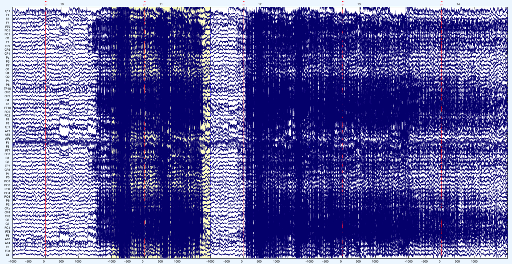
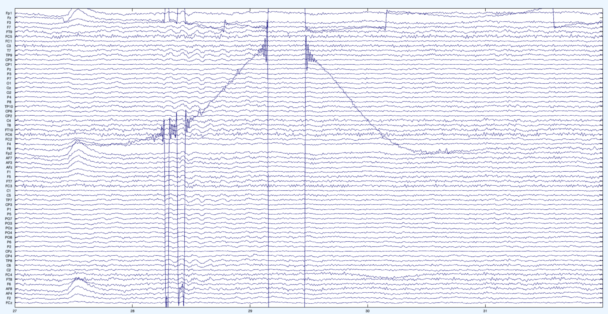
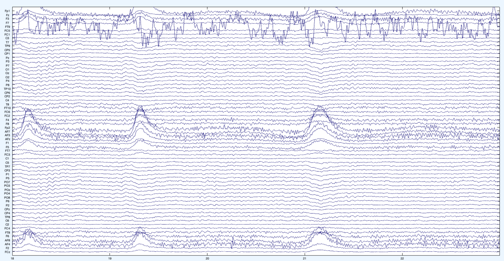
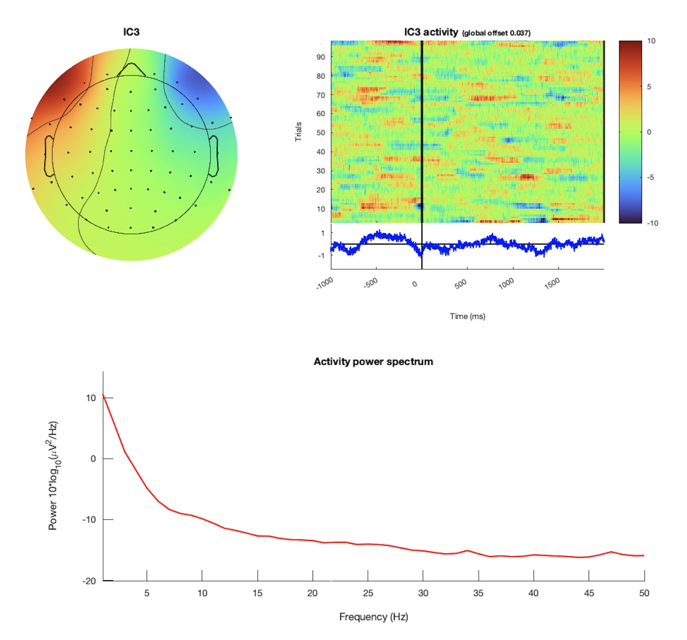
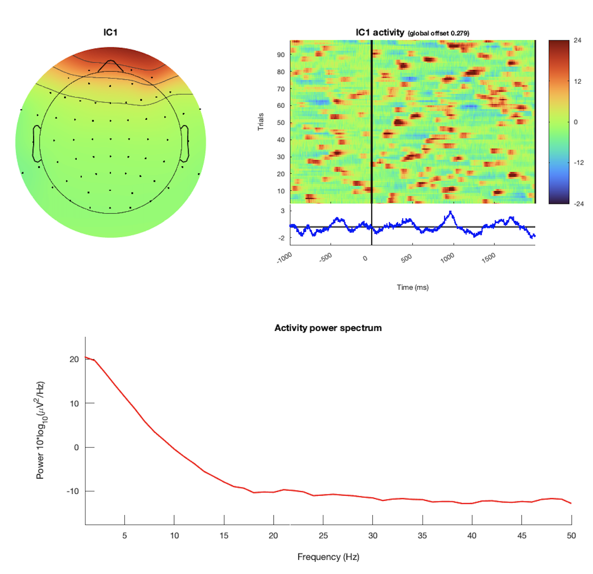
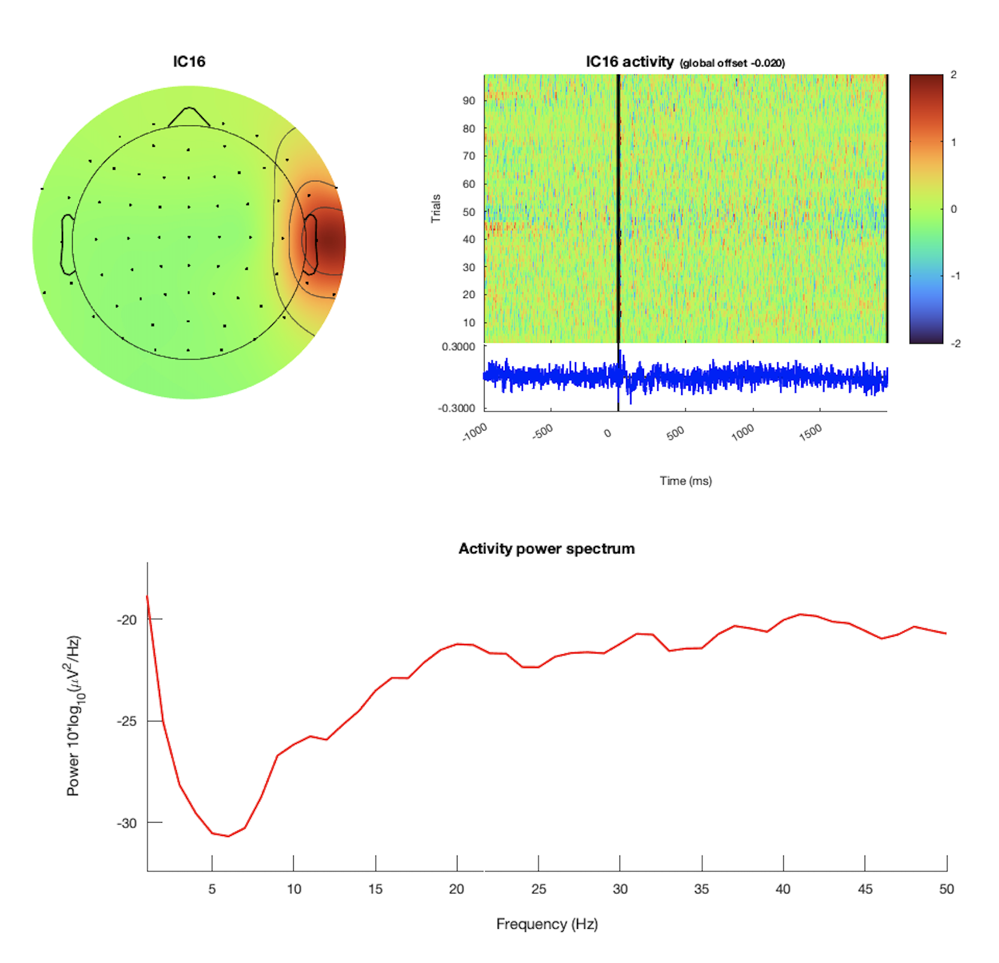
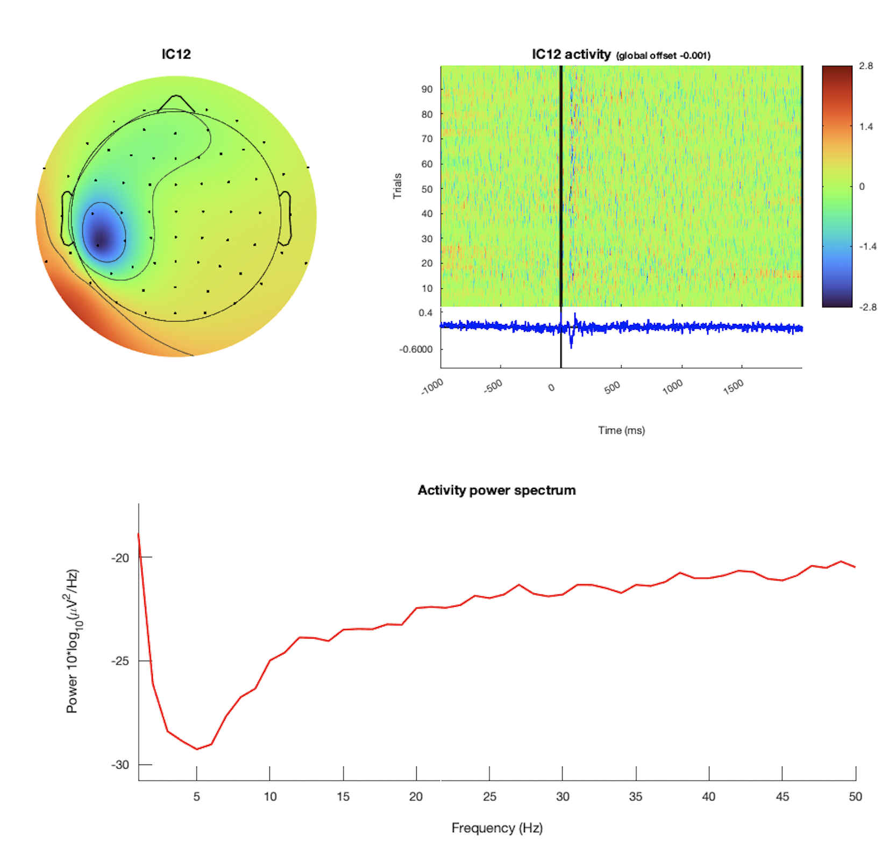
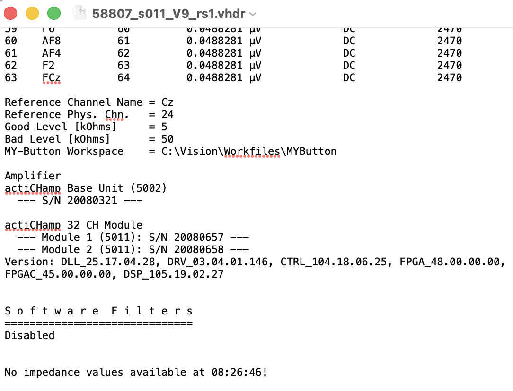

# EEG QC Workflow

This guide summarizes the EEG QC workflow for eyes-open resting-state EEG, including required files, rejection criteria, sanity checks, and visual examples.

## Required Files

EEG QC requires the three BrainVision files for each recording:

- `.vhdr`: BrainVision header file containing recording metadata, channel information, and impedance values when available.
- `.vmrk`: BrainVision marker file containing event markers and timing information for the recording.
- `.eeg`: BrainVision binary data file containing the recorded EEG signal.

## EEG-Based Exclusion QC

The preprocessing pipeline is semi-automated and generally runs without manual intervention. However, human review is required at three rejection steps:

- Epoch rejection
- Channel rejection
- ICA artifact rejection

A detailed description of the preprocessing pipeline is available here: [BSL EEG Pre-Processing Pipeline for Eyes Open rsEEG](https://docs.google.com/document/d/10Rvj0-LhDYRoRaD8N_zv_DT_DlLCnNtGqXTbCXcKCoM/edit?tab=t.0).

## Epoch Rejection

Epoch rejection removes recording segments that are contaminated by large-amplitude noise. Epochs should only be rejected when the artifact is extreme and clearly visible.

The preprocessing script selects epochs automatically, but reviewer input is required when too many epochs are rejected. In that case, the reviewer must decide whether to override the rejection step or mark the recording as unusable.

As a general rule, a recording should include at least 2 minutes of usable data to be included in an analysis.

### Epoch Rejection Example

Reject / Flag

<table>
  <tr>
    <td valign="top">
       
      This is a bad recording segment. The high-amplitude and high-frequency portions immediately after the start and near the end should be rejected. Epochs selected for rejection should contain noise across most or all channels, should not be location-specific, and should be clearly noticeable. In this example, the participant may have started grinding their teeth or moving their jaw.
    </td>
  </tr>
</table>

## Channel Rejection

Channel rejection removes and interpolates abnormal channels.

Abnormal channels are identified using the following indicators:

- High standard deviation from the average 64-channel time series and spectral power.
- High impedance (`> 25 kOhms`).
- Bridging, measured as a strong correlation between one channel time series and another.

The preprocessing script flags abnormal channels automatically, but reviewer input is required when too many channels are flagged. Interpolating many channels is bad practice, especially when the flagged channels are clustered together, because this effectively creates data in that region.

When more than 15% of channels are flagged, the reviewer must decide whether to override the rejection step or mark the recording as unusable.

### Channel Rejection Examples

Reject / Flag

<table>
  <tr>
    <td valign="top" width="50%">
       
      <strong>Bad channel example: F8</strong> 
      This is an example of a bad channel (`F8`). This image shows one time window, but repeated amplitude jumps are visible when scrolling through the full recording. The channel was likely not fixed securely to the cap or scalp and may have moved during recording.
    </td>
    <td valign="top" width="50%">
       
      <strong>Bad channel example: FT9</strong> 
      `FT9` is another example of a bad channel. The amplitudes are not realistic, and the channel deviates strongly from the behavior of the other channels.
    </td>
  </tr>
</table>

## ICA Artifact Rejection

ICA artifact rejection removes eye and muscle artifacts from the data.

The preprocessing script generates independent components (ICs) and uses EEGLab's ICLabel algorithm to classify them. ICLabel assigns each component a class label and confidence percentage. Muscle and eye ICs above the pipeline threshold are flagged for review.

Reviewer input is especially important at this stage because fully automated ICA can over-reject data. To reduce this risk, the pipeline makes an initial decision, and the reviewer then checks all flagged components and either confirms or edits the selection.

When reviewing an IC, consider all of the following:

- Topography.
- Time series.
- Power spectrum.

### Eye Artifacts

Eye artifacts are usually the easiest ICs to identify because they have a consistent appearance across datasets.

Eye artifact examples

<table>
  <tr>
    <td valign="top" width="50%">
       
      <strong>Horizontal eye movements</strong> 
      Horizontal eye movements appear as opposing activation in the frontal electrodes of each hemisphere. They also have a smooth, decreasing power spectrum and longer-lasting blips in the trial plot.
    </td>
    <td valign="top" width="50%">
       
      <strong>Blinks</strong> 
      Blinks show activation in the frontal channels only. They have a smooth, decreasing power spectrum and appear as clear blips in the trial plot.
    </td>
  </tr>
</table>

### Muscle Artifacts

Muscle artifacts commonly appear in frontal and temporal channels, especially near the eyes, jaw, ears, and forehead. These artifacts are often reduced during ICA-based preprocessing, but the processed EEG should still be reviewed for residual contamination when many muscle-related ICs are identified.

Muscle artifacts are harder to identify than eye artifacts, so reviewers should be conservative. If it is unclear whether a component is muscle artifact, leave it in the data. It is better to keep a possible artifact than to over-reject, because ICA is not a perfect source separation method and every IC can still contain real brain activity.

Muscle artifacts can be identified using the following characteristics:

- They tend to appear around the eyes, ears, and jaw.
- They sometimes look like a dipole.
- They usually affect only a small number of electrodes.
- The trial plot tends to look like static noise.
- The power spectrum increases at higher frequencies because muscle artifacts are captured by approximately `20-50 Hz` activity.

If these conditions are not met, the component generally should not be rejected.

This is especially important for beta- and gamma-band analyses. Muscle noise can contaminate these frequency bands, and apparent gamma activity may reflect muscle contamination rather than neural activity.

Flag recordings for exclusion or additional sensitivity analyses when they show any of the following:

- A large number of muscle-related ICs.
- Residual high-frequency noise after ICA.
- Disproportionate high-frequency activity in specific frontal or temporal channels.

These recordings may require exclusion or additional sensitivity analyses before they are included in downstream EEG frequency analyses.

Muscle artifact examples

<table>
  <tr>
    <td valign="top" width="50%">
       
      <strong>Muscle artifact example 1</strong>
    </td>
    <td valign="top" width="50%">
       
      <strong>Muscle artifact example 2</strong>
    </td>
  </tr>
</table>

## Additional Sanity Checks

### Missing Impedance Values

The `.vhdr` file should contain impedance values for all channels. Sometimes impedance values are missing because the system was disconnected during recording. When this happens, reviewers cannot determine whether impedance was too high, so the issue should be flagged.

Missing-impedance example

 

Example missing-impedance message: **No impedance values available at 08:26:46!**

### Eyes-Open vs. Eyes-Closed Recordings

Resting-state EEG recordings may be collected under either eyes-open or eyes-closed conditions. These recording types are physiologically distinct and should not be combined in the same analysis.

This protocol is designed for eyes-open resting-state EEG. Eyes-closed recordings are expected to be rare, but if one is identified, it should be flagged and excluded.

To identify possible eyes-closed recordings, inspect the raw time series for eye blinks. In eyes-open recordings, blink activity should usually be visible, especially in frontal channels. If blink activity is absent across the recording and the signal appears unusually flat or stable, the recording may have been collected with eyes closed and should be reviewed carefully.

## Helpful Resources

The main toolboxes for EEG preprocessing are FieldTrip and EEGLab.

- [FieldTrip tutorial for MATLAB users](https://www.fieldtriptoolbox.org/tutorial/)
- [EEGLab tutorial PDF](https://sccn.ucsd.edu/eeglab/download/eeglabtutorial4.2.pdf)
- [EEGLab tutorials](https://eeglab.org/tutorials/)
  The rs-EEG pipeline uses EEGLab.
- **Mike X Cohen**
  Useful source for EEG-focused signal analysis. His materials focus more on analysis than preprocessing.
- [BSL EEG Pre-Processing Pipeline for Eyes Open rsEEG](https://docs.google.com/document/d/10Rvj0-LhDYRoRaD8N_zv_DT_DlLCnNtGqXTbCXcKCoM/edit?tab=t.0)
- [Recruitment Tracking Sheet](https://docs.google.com/spreadsheets/d/1hvjAztXkUSMyTgMj4K3OI33AxFAqFZEg6-EcusuIr2o/edit?usp=sharing)
  Helpful resource for verifying screening ID, enrolled participant ID, and additional retreatment or OL ID with timestamps for scheduled visits. `fmriprep` reports, `figures/`, and other QC materials from the project directories.
