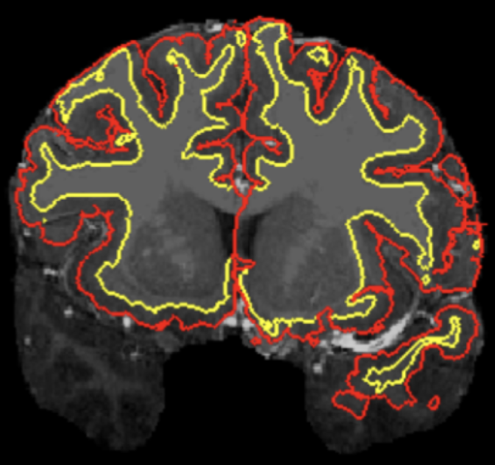
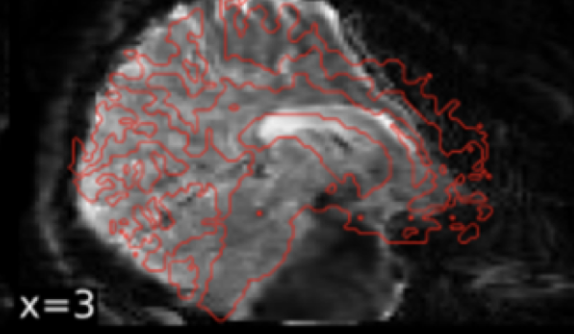
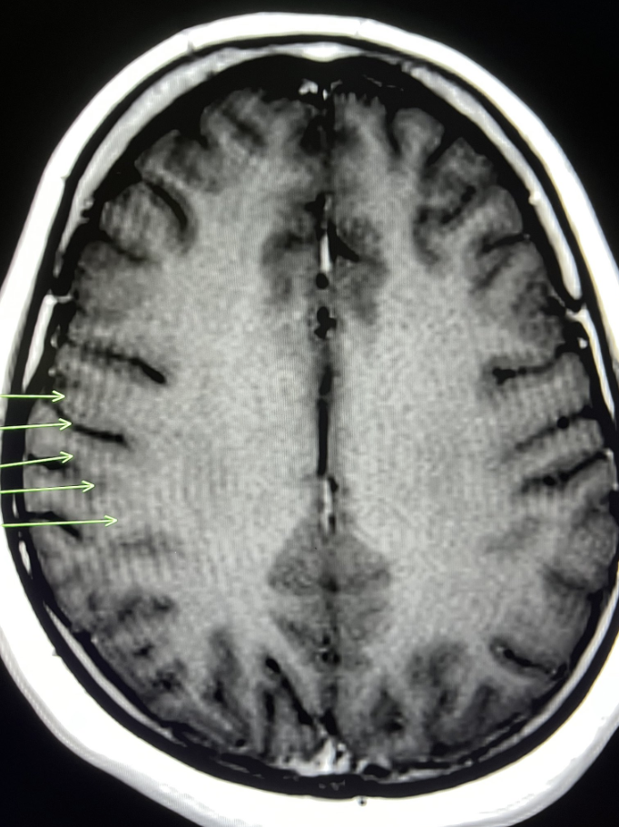
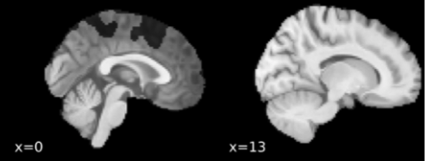
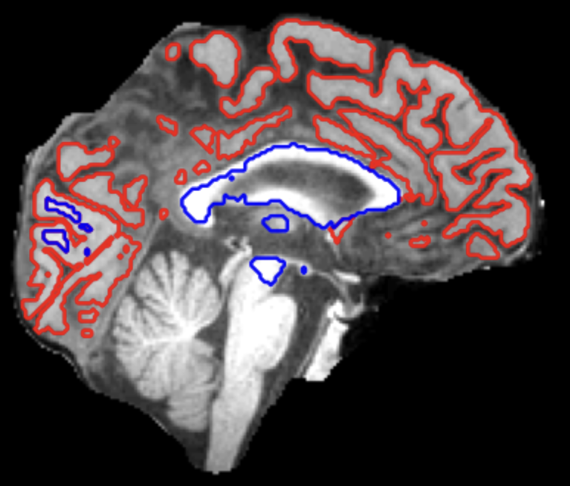
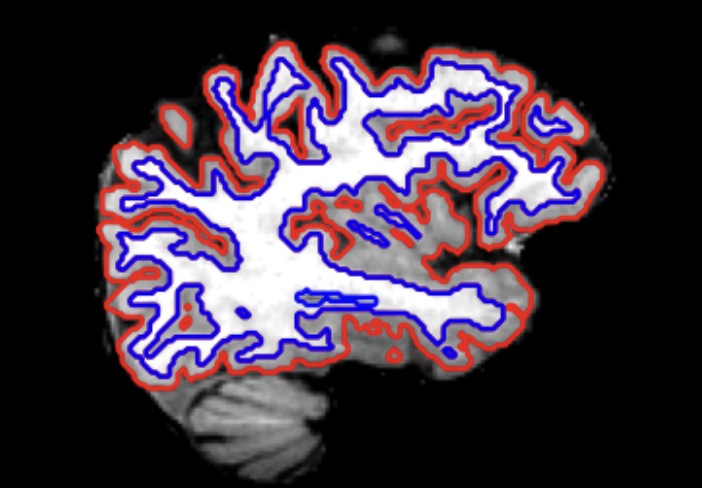
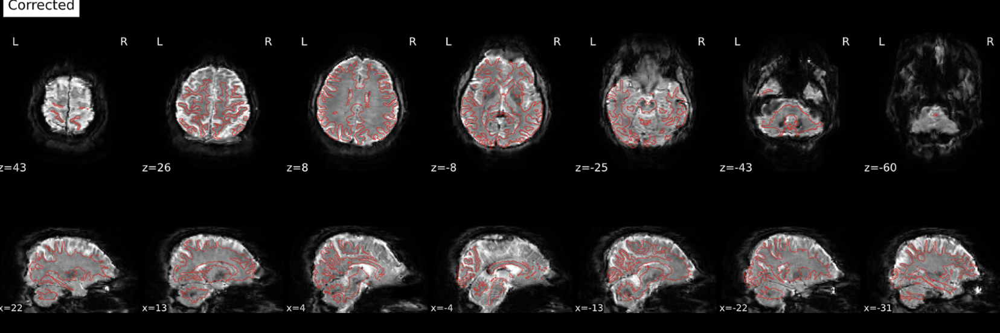
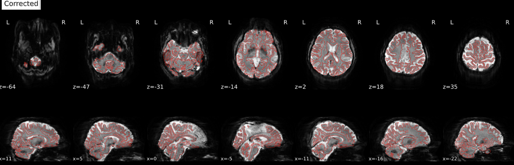

# Imaging QC Workflow

This document summarizes how imaging QC was done for the Brains dataset, using the archived notes in `dataset-QC-workflow/histories`. It is meant to be a practical template for building a clean inclusion/exclusion list from a BIDS dataset without changing the raw BIDS archive itself.

## Starting file

- Starting dataset: raw BIDS plus the modality-specific preprocessing outputs used for QC.
- For Brains, the practical QC inputs were not just raw BIDS. They also included:
  - `fmriprep` HTML reports and `figures/`
  - FreeSurfer structural QC outputs
  - study tracking notes
  - REDCap exports
  - the freeze inclusion ledger and derived QC tables

Brains-specific QC inputs

- Study-wide inclusion ledger:
  - `subjects_inclusion_FREEZE.csv`
  - subject tracking workbook
  - README-style study notes and session caveats
- Structural QC inputs:
  - `structural_file_usage_filtered.csv`
  - `hippocampal_region_sums.csv`
  - FreeSurfer QC PNGs / structural views in the `fmriprep` report
- Functional QC inputs:
  - `fmriprep` HTML reports
  - BOLD/fieldmap distortion-correction views
  - automated motion and signal metrics such as FD and tSNR

## Output file

- Keep the original BIDS dataset unchanged.
- Write QC decisions to derived freeze artifacts and analysis tables.
- Minimum output:
  - a clean subject-session inclusion/exclusion ledger
  - explicit reasons for exclusion
  - modality-specific QC notes when exclusions are image-based rather than clinic-based

Brains-specific outputs

- Main inclusion ledger:
  - `subjects_inclusion_FREEZE.csv`
- Consolidated subject manifests:
  - `subjects.json`
  - `subjects.md`
- Structural analysis outputs:
  - `analysis/mainanalyses_struct_python/inclusion_flow.csv`
  - `merged_demo.csv`
  - `merged_demo_madrs.csv`
- Important limitation:
  - structural QC was codified as an executable freeze
  - functional QC was documented and reviewed, but it was not yet mirrored by an equally complete scripted freeze package

## Clinic-based Inclusion/Exclusion Criteria

- Apply non-imaging exclusions before image QC.
- Record these in a subject-session ledger so later imaging exclusions do not overwrite the clinical history.
- Common reasons:
  - withdrew from the study
  - did not meet trial requirements
  - ineligible per clinical review
  - session should not be analyzed based on study team notes
  - additional exceptions discovered from REDCap or after checking with study staff

How this was tracked in Brains

- The Brains freeze combined:
  - full-participant exclusions
  - session-level exclusions
  - tracking-workbook notes
  - REDCap-derived information
  - imaging QC failures
- The inclusion ledger and subject manifest were treated as the authoritative record of why a subject or session was kept or dropped.
- Practical rule:
  - do not collapse clinic-based and image-based exclusions into one vague label
  - keep the reason explicit so the final sample can be reproduced later

## Structural-Based Exclusion (QC)

- Structural QC was done in two layers:
  - manual review of structural processing quality
  - executable freeze rules used for the final structural analysis sample

### What to exclude

- Gross mismatch between the T1 image and the cortical ribbon / white-matter surfaces
- Widespread segmentation failure rather than a small local imperfection
- Catastrophic alignment failures
- Structural images that are so compromised that downstream registration cannot be trusted

### Visual QC Reference

Use the examples below as a compact guide for how to classify common structural cases in Brains.

Reject / Flag

<table>
  <tr>
    <td valign="top" width="50%">
       
      <strong>Cortical surface reconstruction inaccurate</strong> 
      <strong>Verdict:</strong> Reject. 
      The cortical ribbon is grossly misaligned in the temporal lobes, so downstream registration cannot be trusted.
    </td>
    <td valign="top" width="50%">
       
      <strong>Segmentation or underlying T1 looks comically bad</strong> 
      <strong>Verdict:</strong> Reject / flag for review. 
      This is the kind of catastrophic failure that should be excluded even if it does not match a canned example exactly.
    </td>
  </tr>
</table>

Accept With Caveats

<table>
  <tr>
    <td valign="top" width="50%">
       
      <strong>Gibbs ringing</strong> 
      <strong>Verdict:</strong> Conditional accept. 
      Heavy ringing should usually prevent a top score, but it can still pass if the gray/white matter boundary is otherwise well-tracked.
    </td>
    <td valign="top" width="50%">
       
       
      <strong>Images that may falsely appear to be bad</strong> 
      <strong>Verdict:</strong> Usually accept. 
      Use anatomical context before failing scans around sulcal spaces, basal ganglia, hippocampus, or amygdala. `ok5.png` and `ok7.png` are both examples of views that can look wrong if judged slice-by-slice without considering the surrounding anatomy.
    </td>
  </tr>
</table>

Accept / Normal Variants

<table>
  <tr>
    <td valign="top" width="33%">
       
      <strong>Mid-sagittal slice can look bad</strong> 
      <strong>Verdict:</strong> Accept. 
      Increased interhemispheric space at the midline is not itself a failure.
    </td>
    <td valign="top" width="33%">
       
      <strong>Longitudinal midline views can look discontinuous</strong> 
      <strong>Verdict:</strong> Accept. 
      When a slice captures lots of CSF between hemispheres, irregular ribbons can be a sign that FreeSurfer is behaving correctly.
    </td>
    <td valign="top" width="33%">
       
      <strong>Good segmentation</strong> 
      <strong>Verdict:</strong> Accept. 
      Gray and white matter boundaries are well captured, even if the image is not absolutely perfect.
    </td>
  </tr>
</table>

### Common exclusion criteria used in Brains

- For averaged structural images used in preprocessing:
  - score on a 1-4 scale
  - `3` or `4` = pass
  - `1` or `2` = fail
- For executable structural freeze construction:
  - subject must first pass the structural file-usage gate
  - session must pass automated QC: `EulerTotal < 100`
  - session must not be in the manual exclusion list
  - session may still be excluded if it was absent from the finalized historical structural freeze used for replication

Brains structural QC details

- Manual rating scale from the archived Brains QC notes:
  - `1`: extremely poor processing; unusable for downstream alignment
  - `2`: sub-par image/alignment/surface with widespread errors
  - `3`: mostly good; minor deviations are exceptions
  - `4`: pristine image, template alignment, and surface reconstruction
- Structural artifacts explicitly called out as true failures:
  - cortical ribbon far off the anatomy
  - poor temporal-lobe segmentation
  - catastrophic structural failures even if they do not match a canned example
- Structural patterns explicitly called out as not automatic failures:
  - midsagittal gaps between hemispheres
  - imperfect-looking basal ganglia / hippocampus / amygdala boundaries in this cortical QC view
  - small bubble-like sulcal spaces that are anatomically continuous across slices
  - Gibbs ringing, if gray/white boundary detection still looks good
- Executable Brains structural freeze rules from `qc_workflow.md`:
  - auto QC pass: `EulerTotal < 100`
  - manual exclusions:
    - `s018 ses-V4`
    - `s019 ses-V4`
    - `s019 ses-V5`
    - `s019 ses-V6`
    - `s019 ses-V7`
    - `s040 ses-V7`
    - `s044 ses-V4`
    - `s051 ses-V8`
  - analysis-matching exclusions (`R_STRUCT_ABSENT_KEYS`):
    - `s019_ses-V9`
    - `s034_ses-V10`
    - `s035_ses-V9`
    - `s040_ses-V6`
    - `s045_ses-V6`
    - `s045_ses-V9`

### Helpful resources

- `fmriprep` structural HTML report and `figures/`
- FreeSurfer QC report images
- `structural_file_usage_filtered.csv`
- `hippocampal_region_sums.csv`
- References used in the Brains QC notes for anatomy review:
  - hippocampal labeling papers linked in the archived QC PDF

## Functional Imaging-Based Exclusion (QC)

- Functional QC in Brains relied on both automated metrics and manual review.
- Automated metrics such as FD and tSNR were considered useful for masking/censoring and for detecting poor scans.
- Manual QC was intentionally narrower: catch egregious failures that automated metrics could miss.

### What to exclude

- Obvious preprocessing failures that make the BOLD data unreliable
- Catastrophic susceptibility distortion correction errors
- Scan/session combinations with severe functional problems that cannot be rescued by ordinary censoring or masking

### Visual QC Reference

The functional examples below all center on susceptibility distortion correction, which was the main manual QC target in Brains.

Reject / Fail

<table>
  <tr>
    <td valign="top" width="50%">
       
      <strong>Improper susceptibility distortion correction: catastrophic</strong> 
      <strong>Verdict:</strong> Reject. 
      This occurred when BOLD images were encoded in <code>ARS</code> coordinates but fieldmaps were in <code>RPI</code>.
    </td>
    <td valign="top" width="50%">
       
      <strong>Improper susceptibility distortion correction: still bad, but subtler</strong> 
      <strong>Verdict:</strong> Reject. 
      This occurred when both BOLD and fieldmaps were encoded in <code>ARS</code>; the image is better than the catastrophic case but still not acceptable.
    </td>
  </tr>
</table>

Accept / Pass

<table>
  <tr>
    <td valign="top">
       
      <strong>Proper susceptibility distortion correction</strong> 
      <strong>Verdict:</strong> Accept. 
      Distortion correction worked when both BOLD and fieldmaps were correctly treated as <code>RPI</code>. In Brains, all scans were acquired <code>RPI/RPI</code>, but older <code>dcm2niix</code> versions sometimes mislabeled GE scans as <code>ARS</code>, which then broke phase-encoding correction.
    </td>
  </tr>
</table>

### Common exclusion criteria used in Brains

- Review was binary rather than continuous:
  - pass if all functional scans for the subject passed review
  - fail if at least one functional scan did not pass
- If a subject failed, the notes recorded the exact bad scans:
  - session `V2-V10`
  - scan number `rs1-rs4`
- Manual review focused especially on susceptibility distortion correction problems rather than trying to manually rate every small quality difference

Brains functional QC details

- The archived Brains QC notes describe manual functional QC as a pass/fail screen for egregious errors.
- Automated metrics named in the notes:
  - FD for head motion
  - tSNR for signal quality
- The key Brains-specific functional issue was susceptibility distortion correction failure:
  - catastrophic failures occurred when BOLD images were encoded in `ARS` coordinates but fieldmaps were in `RPI`
  - subtler but still bad failures occurred when both BOLD and fieldmaps were encoded in `ARS`
  - distortion correction worked when both were correctly treated as `RPI`
- Historical interpretation from the archived notes:
  - all scans were acquired `RPI/RPI`
  - older `dcm2niix` versions sometimes mislabeled GE scanner data as `ARS`
  - because phase-encoding direction was interpreted relative to coordinates, this coordinate error caused bad distortion correction
- Important workflow limitation:
  - unlike structural QC, the current repo did not yet implement a full functional freeze with standardized file inventory, QC table, manual exclusion table, and inclusion-flow outputs

### Helpful resources

- `fmriprep` functional HTML reports
- distortion-correction panels for BOLD/fieldmap alignment
- FD and tSNR summaries
- References linked in the archived Brains QC notes:
  - susceptibility artifact background
  - Sherlock OnDemand access instructions for report review

## Scanner- and Site-Dependent Artifacts

- Always check whether site, scanner, conversion software, or protocol changes introduced systematic artifacts.
- Do this before finalizing the analysis sample, and document the check in the freeze record.

### What to verify

- scanner vendor / model / upgrade timing
- dcm2niix version or other DICOM-to-BIDS conversion changes
- orientation labels and phase-encoding direction
- fieldmap presence and correct pairing with BOLD scans
- special session naming issues, missing folders, or “do not use” notes in the file structure

Brains-specific scanner/site checks

- Functional QC revealed a scanner/conversion-specific issue:
  - older `dcm2niix` versions sometimes mishandled GE data and assigned `ARS` coordinates to scans that were actually `RPI`
  - this broke susceptibility distortion correction because the phase-encoding direction was interpreted in the wrong coordinate frame
- Structural workflow also included a scanner-upgrade sensitivity check:
  - freeze a list of scans acquired before the upgrade
  - run the upgrade comparison on the already matched structural analysis sample, not on the raw full dataset
  - compare pre- vs post-upgrade effects with saved model summaries
- Recommended QC actions based on the Brains workflow:
  - keep a scanner-change log
  - track conversion software versions
  - verify orientation and distortion-correction behavior visually in reports
  - save an explicit pre/post-upgrade registry and sensitivity analysis

## Bottom Line

- In Brains, the cleanest workflow was:
  - apply clinic-based inclusion/exclusion first
  - build a subject-session ledger
  - run structural QC with explicit automated and manual rules
  - run functional QC to catch egregious preprocessing failures, especially distortion-correction errors
  - document scanner/software artifacts separately
  - keep the final inclusion/exclusion reasons explicit and auditable
- The main asymmetry to avoid in future datasets:
  - structural QC was executable and reproducible
  - functional QC was real and documented, but not yet standardized into the same kind of freeze tables
