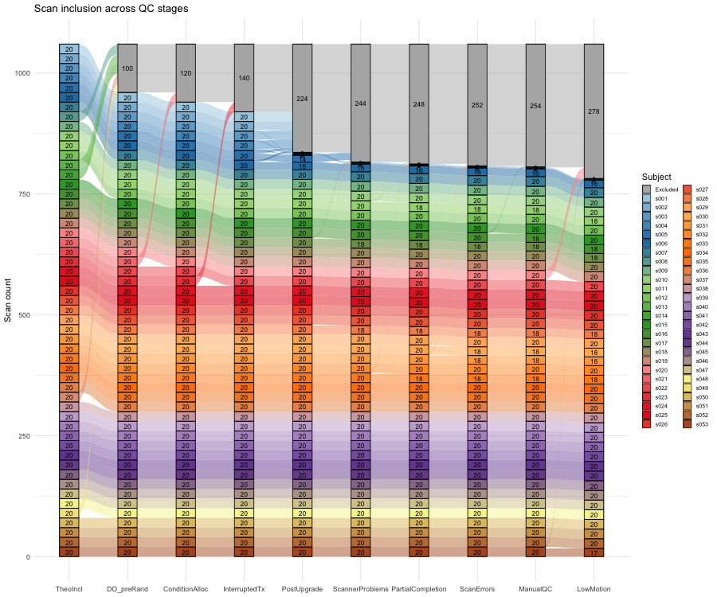
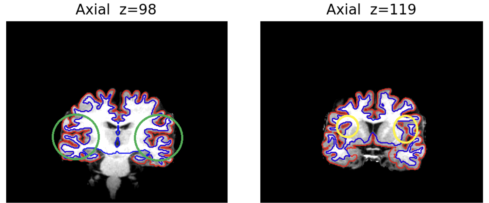
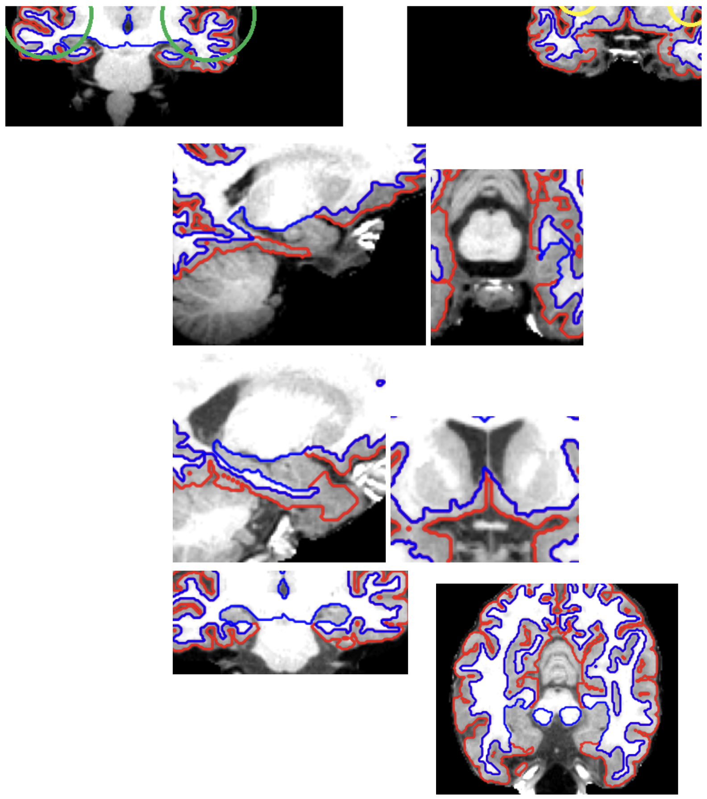
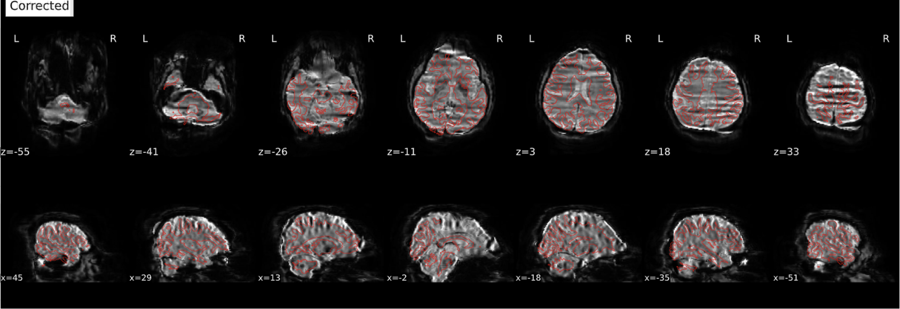
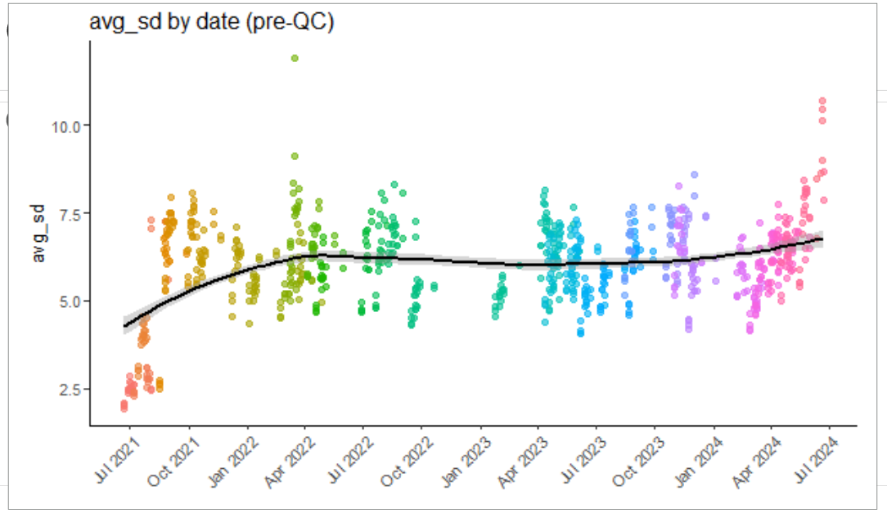
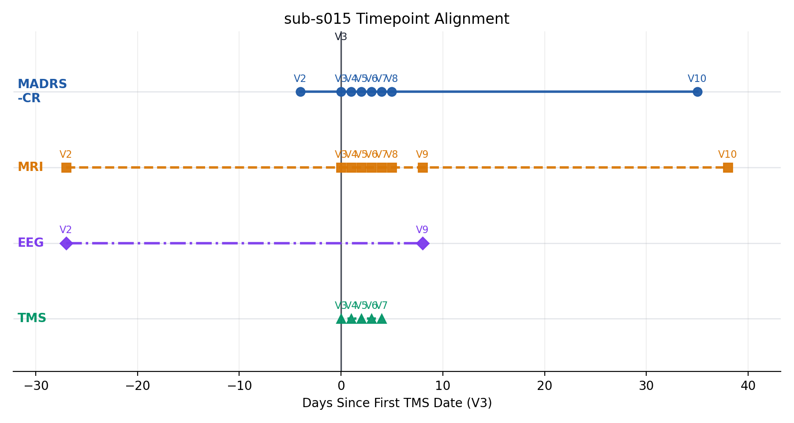

# Imaging QC Workflow

This document summarizes a template for building an analysis-ready clean imaging dataset from its BIDS curation. It documents QC experiences for cleaning the Brains dataset for demonstration. 

 

`brains-qc-flow.png` illustrates the QC process applied to the Brains dataset and the resulting dataset at each QC stage.

## Starting file

- Raw BIDS
- Exclusion subject list (from clinical trial)
- `fmriprep` HTML reports, BOLD/fieldmap distortion-correction views, and automated motion and signal metrics such as FD and tSNR (these can often be found in `figures/` from pipeline outputs)
- FreeSurfer structural QC outputs and modality-specific derivatives
- Study tracking notes (from study leads and staffs)
- REDCap exports

## Output file

- Keep the original BIDS dataset unchanged (read-only!).
- Write QC decisions to separate artifacts and analysis tables.
- Minimum output:
  - a clean subject-session (at the single-sample level) inclusion/exclusion ledger (will be frozen prior to analysis starts)
  - explicit reasons for exclusion (clearly state if exclusions are image-based or clinic-based)

## Clinic-based Inclusion/Exclusion Criteria

- Apply non-imaging exclusions before image QC.
- Common reasons:
  - withdrew from the study
  - did not meet trial requirements
  - ineligible per clinical review
  - session should not be analyzed based on study team notes
  - additional exceptions discovered from REDCap or after checking with study staff
- Tips: Record these in a subject-session ledger so later imaging exclusions do not overwrite the clinical history.

How this was tracked in Brains

- The Brains freeze combined:
  - full-participant exclusions
  - session-level exclusions
  - tracking-workbook notes
  - REDCap-derived information
  - imaging QC failures
- The inclusion ledger and subject manifest were treated as the authoritative record of why a subject or session was kept or dropped.
- Tips:
  - do not collapse clinic-based and image-based exclusions into one vague label
  - keep the reason explicit so the final sample can be reproduced later

## Structural-Based Exclusion (QC)

- Structural QC was done in 2 parts:
  - manual review of structural processing quality
  - executable freeze rules used for the final structural analysis sample

### What to exclude

- Gross mismatch between the T1 image and the cortical ribbon / white-matter surfaces
- Widespread segmentation failure rather than a small local imperfection
- Catastrophic alignment failures
- Structural images that are so compromised that downstream registration cannot be trusted

### Visual QC Examples

Reject / Flag

<table>
  <tr>
    <td valign="top" width="50%">
       
      <strong>Cortical surface reconstruction inaccurate</strong> 
      <strong>Verdict:</strong> Reject. 
      The cortical ribbon is grossly misaligned in the temporal lobes, so downstream registration cannot be trusted.
    </td>
    <td valign="top" width="50%">
       
      <strong>Segmentation or underlying T1 looks comically bad</strong> 
      <strong>Verdict:</strong> Reject / flag for review. 
      This is the kind of catastrophic failure that should be excluded even if it does not match a canned example exactly.
    </td>
  </tr>
</table>

Accept With Caveats

<table>
  <tr>
    <td valign="top" width="50%">
       
      <strong>Gibbs ringing</strong> 
      <strong>Verdict:</strong> Conditional accept. 
      Heavy ringing should usually prevent a top score, but it can still pass if the gray/white matter boundary is otherwise well-tracked.
    </td>
    <td valign="top" width="50%">
       
       
      <strong>Images that may falsely appear to be bad</strong> 
      <strong>Verdict:</strong> Usually accept. 
      Use anatomical context before failing scans around sulcal spaces, basal ganglia, hippocampus, or amygdala. Above are both examples of views that can look wrong if judged slice-by-slice without considering the surrounding anatomy. For instance, the isolated circles on the right seem odd and potentially erroneous, but they are actually part of a normal sulcal space that persists across multiple slices in x, y and z.
    </td>
  </tr>
</table>

Accept / Normal Variants

<table>
  <tr>
    <td valign="top" width="33%">
       
      <strong>Mid-sagittal slice can look bad</strong> 
      <strong>Verdict:</strong> Accept. 
      Increased interhemispheric space at the midline is not itself a failure.
    </td>
    <td valign="top" width="33%">
       
      <strong>Longitudinal midline views can look discontinuous</strong> 
      <strong>Verdict:</strong> Accept. 
      When a slice captures lots of CSF between hemispheres, irregular ribbons can be a sign that FreeSurfer is behaving correctly.
    </td>
    <td valign="top" width="33%">
       
      <strong>Good segmentation</strong> 
      <strong>Verdict:</strong> Accept. 
      Gray and white matter boundaries are well captured, even if the image is not absolutely perfect.
    </td>
  </tr>
</table>

### Brains Structural QC 

Details

- Manual rating scale from the archived Brains QC notes:
  - `1`: extremely poor processing; unusable for downstream alignment
  - `2`: sub-par image/alignment/surface with widespread errors
  - `3`: mostly good; minor deviations are exceptions
  - `4`: pristine image, template alignment, and surface reconstruction
- Structural artifacts identified as failures:
  - cortical ribbon far off the anatomy
  - poor temporal-lobe segmentation
  - catastrophic structural failures even if they do not match a canned example
- Structural patterns identified as not automatic failures:
  - midsagittal gaps between hemispheres
  - imperfect-looking basal ganglia / hippocampus / amygdala boundaries in this cortical QC view
  - small bubble-like sulcal spaces that are anatomically continuous across slices
  - Gibbs ringing, if gray/white boundary detection still looks good
- Executable Brains structural QC rules:
  - session must not be in the manual exclusion list, either clinic- or imaging-based
  - auto QC pass: `EulerTotal < 100`

### Helpful resources

- [Sherlock OnDemand](https://ondemand.sherlock.stanford.edu/)
  Sherlock OnDemand. This was the main access point for downloading `fmriprep` reports, `figures/`, and other QC materials from the Brains project directories.
- [Data team Next Week's Data](https://docs.google.com/spreadsheets/d/19XX4K6LOH8vimpAiRn8btXlF4cB4rJ2zvlaxLGOKz7E/edit?usp=sharing)
  Internal data-team tracking sheet documenting data-quality issues observed during the trial. Useful for cross-checking subject/session-specific notes alongside the structural QC review.
- [MRI QC background paper](https://pmc.ncbi.nlm.nih.gov/articles/PMC3254728/)
  Background reading on why MRI image-quality problems can create misleading findings and why QC matters so much for downstream inference.
- [Gibbs artifact reference](https://mriquestions.com/gibbs-artifact.html)
  MRIQuestions overview of Gibbs artifact / Gibbs ringing. Helpful when deciding whether visible ringing is severe enough to compromise gray/white boundary detection.
- [Hippocampal labeling reference 1](https://pubs.rsna.org/doi/full/10.1148/rg.210153)
  Hippocampal labeling reference suggested in the Brains QC notes for reviewing medial temporal lobe anatomy and avoiding false positives during structural QC.
- [Hippocampal labeling reference 2](https://insightsimaging.springeropen.com/articles/10.1007/s13244-016-0541-2)
  Additional hippocampal labeling / anatomy reference suggested in the Brains QC notes for checking whether odd-looking medial temporal segmentations are actually expected.

## Functional Imaging-Based Exclusion (QC)

- Functional QC in Brains relied on both automated metrics and manual review.
- Automated metrics such as FD (head motion) and tSNR (signal) were considered useful for masking/censoring and for detecting poor scans.
- Manual QC was intentionally narrower: catch egregious failures that automated metrics could miss.

### What to exclude

- Obvious preprocessing failures that make the BOLD data unreliable
- Catastrophic susceptibility distortion correction errors
- Scan/session combinations with severe functional problems that cannot be rescued by ordinary censoring or masking

### Visual QC Examples

Reject / Fail

<table>
  <tr>
    <td valign="top" width="50%">
       
      <strong>Improper susceptibility distortion correction: catastrophic</strong> 
      <strong>Verdict:</strong> Reject. 
      This occurred when BOLD images were encoded in <code>ARS</code> coordinates but fieldmaps were in <code>RPI</code>.
    </td>
    <td valign="top" width="50%">
       
      <strong>Improper susceptibility distortion correction: still bad, but subtler</strong> 
      <strong>Verdict:</strong> Reject. 
      This occurred when both BOLD and fieldmaps were encoded in <code>ARS</code>; the image is better than the catastrophic case but still not acceptable.
    </td>
  </tr>
</table>

Accept / Pass

<table>
  <tr>
    <td valign="top">
       
      <strong>Proper susceptibility distortion correction</strong> 
      <strong>Verdict:</strong> Accept. 
      Distortion correction worked when both BOLD and fieldmaps were correctly treated as <code>RPI</code>. In Brains, all scans were acquired <code>RPI/RPI</code>, but older <code>dcm2niix</code> versions sometimes mislabeled GE scans as <code>ARS</code>, which then broke phase-encoding correction.
    </td>
  </tr>
</table>

### Brains Functional QC

Details

- Review was binary rather than continuous:
  - pass if all functional scans for the subject passed review
  - fail if at least one functional scan did not pass
- If a subject failed, the notes recorded the exact bad scans:
  - session `V2-V10`
  - scan number `rs1-rs4`
- Manual review focused especially on susceptibility distortion correction problems rather than trying to manually rate every small quality difference
- Automated metrics:
  - FD for head motion
  - tSNR for signal quality
- The key Brains-specific functional issue was susceptibility distortion correction failure:
  - catastrophic failures occurred when BOLD images were encoded in `ARS` coordinates but fieldmaps were in `RPI`
  - subtler but still bad failures occurred when both BOLD and fieldmaps were encoded in `ARS`
  - distortion correction worked when both were correctly treated as `RPI`
- Technical issues:
  - all scans were acquired `RPI/RPI`
  - older `dcm2niix` versions sometimes mislabeled GE scanner data as `ARS`
  - because phase-encoding direction was interpreted relative to coordinates, this coordinate error caused bad distortion correction

### Helpful resources

- [Sherlock OnDemand](https://ondemand.sherlock.stanford.edu/)
  Sherlock OnDemand. Used to access the Brains `fmriprep` HTML reports and associated `figures/` for manual BOLD QC.
- [Data team Next Week's Data](https://docs.google.com/spreadsheets/d/19XX4K6LOH8vimpAiRn8btXlF4cB4rJ2zvlaxLGOKz7E/edit?usp=sharing)
  Internal data-team tracking sheet documenting data-quality issues observed during the trial. Useful for checking session-level notes and flagged concerns while reviewing functional QC decisions.
- [Susceptibility artifact reference](https://www.mriquestions.com/susceptibility-artifact.html)
  MRIQuestions overview of susceptibility artifact. Useful background for understanding the type of frontal and inferior distortions the Brains functional QC was checking.
- [FieldTrip coordinate-system FAQ](https://www.fieldtriptoolbox.org/faq/source/coordsys/)
  FieldTrip coordinate-system FAQ. This is directly relevant to the Brains issue where BOLD and fieldmaps were mislabeled in `ARS` vs `RPI`, which then broke distortion correction.

## Additional Sanity Checks
### Scanner- and Site-Dependent Artifacts

- Always check whether site, scanner, conversion software, or protocol changes introduced systematic artifacts.
- Do this before finalizing the analysis sample, and document the check in the freeze record.

#### What to verify

- scanner vendor / model / upgrade timing
- dcm2niix version or other DICOM-to-BIDS conversion changes
- orientation labels and phase-encoding direction
- fieldmap presence and correct pairing with BOLD scans
- special session naming issues, missing folders, or “do not use” notes in the file structure

Brains-specific scanner/site checks

- Functional QC revealed a scanner/conversion-specific issue:
  - older `dcm2niix` versions sometimes mishandled GE data and assigned `ARS` coordinates to scans that were actually `RPI`
  - this broke susceptibility distortion correction because the phase-encoding direction was interpreted in the wrong coordinate frame
- Structural workflow also included a scanner-upgrade sensitivity check:
  - freeze a list of scans acquired before the upgrade
  - run the upgrade comparison on the already matched structural analysis sample, not on the raw full dataset
  - compare pre- vs post-upgrade effects with saved model summaries

 

- Example: this plot summarizes scanner-upgrade-related artifacts observed in standard-space fMRI outputs and can be used to document pre/post-upgrade sensitivity checks.
- Tips:
  - keep a scanner-change log; stay up-to-date on facility announcements or news
  - track conversion software versions
  - verify orientation and distortion-correction behavior visually in reports
  - save an explicit pre/post-upgrade registry and sensitivity analysis

#### Helpful resources

- [CNI Wiki main page](https://cni.su.domains/wiki/index.php?title=Main_Page)
  CNI facility wiki with technical information for users, including getting started materials, troubleshooting, MR hardware and protocols, data access, and QA-related pages. This is a good first place to check for facility-specific procedures and documentation that may explain site-dependent artifacts.
- [CNI facility news example: Scan Data Acquired From August 2-11](https://cni.su.domains/scan-data-acquired-from-august-2-11/)
  CNI facility-news post from August 20, 2021 describing a coherent MR noise source that was ultimately traced to an environmental issue in the facility. This is a useful example of where site-dependent artifacts may be documented outside the imaging dataset itself.
- [CNI facility news example: Scan Data Acquired From August 19-23](https://cni.su.domains/scan-data-acquired-from-august-19-23/)
  CNI facility-news post from August 26, 2021 documenting the August 17-18, 2021 scanner upgrade and the post-upgrade artifact issue that affected some sequences. Useful for checking whether known upgrade windows overlap with acquisition dates in your study.

### Timepoint Harmonization

- Pair each imaging session with the correct clinical assessment and treatment timepoint.
- This mattered because imaging, clinician ratings, self-report ratings, and TMS treatment did not always happen on the exact same calendar day.
- Instead of assuming event labels were already synchronized, the workflow created an explicit date-alignment layer that could be audited later.

Visual QC of timepoint alignment

 

- Example: this plot illustrates event timepoints of patient `s015` from the Brains trial, whose baseline MADRS was evaluated 23 days after baseline neuroimaging visit.
- Clinician notes explained: "patient became numb with medication dose increase during screening, elected to discontinue medication and then pursue treatment with us"
- Tip: flag mismatched date assignments, missing date fields, and suspiciously large gaps between treatment, scan, and symptom assessment

## Summary

- Basic workflow:
  - preprocess and curate imaging data to BIDS organization
  - apply clinic-based inclusion/exclusion first
  - build a subject-session ledger
  - run structural QC with explicit automated and manual rules
  - run functional QC to catch egregious preprocessing failures, especially distortion-correction errors
  - QC additional sources of bias, such as scanner and software versioning, timestamp harmonization, etc.; document additional artifacts separately
